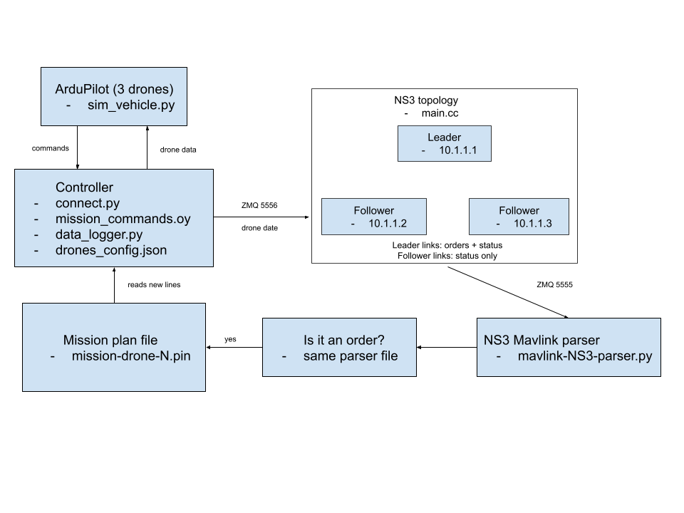

# UAVLnQ Code Review Report

**Related documents**

- The UAVLnQ source code: our team fork, commit `78f81d64`
- `docs/uavlnq/run2-evidence.md`: the logs and measurements from my second run
- The architecture diagram with file names: `uavlnq-architecture.png`, shown as Figure 1 in this report

## 1. Summary

I reviewed UAVLnQ to find out whether our team can build the swarm testbed on top of it. The short answer is yes, but not as it stands.

It does run. In my second run the leader drone sent six waypoint orders across the simulated Wi-Fi mesh, and both followers flew to every one of them. The way it starts the drones, models the Wi-Fi and feeds drone positions into the network is solid, and I think we should keep all three.

I also found 29 problems: 4 high, 13 medium and 12 low. Three of the high ones stand between us and our MVP:

- **F6.** An order reaches the drone even when the simulated network drops it. If we attacked the network today, the drones would not notice.
- **F5.** Ground control is not part of the mesh. It talks to each drone directly, so it cannot go through the leader the way our design needs.
- **F7.** Mission files from an earlier run are still there on the next run and get flown again.

**My recommendation is to reuse UAVLnQ with rework.** We keep the parts in section 8 and fix the parts in section 9. Because the project has no license (F12), we should treat it as a design to learn from and write our own versions of any file we change.

## 2. What I reviewed

UAVLnQ is the research code published with Yousef et al., DASIP 2026 (LNCS 16512). I reviewed our fork at commit `78f81d64`. That is the authors' code plus three small additions of ours: a Codespaces setup, an install script, and one longer timeout in `connect.py`.

| File | Lines | What it does |
|---|---|---|
| `connect.py` | 438 | Mission controller. It also acts as the ground station. |
| `mission_commands.py` | 212 | The flight commands the controller can issue |
| `data_logger.py` | 78 | Saves telemetry to CSV files |
| `mission.py` | 98 | Nothing. It is not used. |
| `Mavlink-NS3-Parser.py` | 197 | Listens to ns-3 and writes waypoint orders into the mission files |
| `drones_config.json` | 11 | Drone count, ports and the path to ns-3 |
| `scratch/3-Leader-Follower-Drone-Mesh/main.cc` | 531 | The ns-3 Wi-Fi mesh: one leader and two followers |
| **Total** | **1,565** | |

I only skimmed the attacker version (`scratch/3-Leader-Follower-Drone-Mesh-with-attacker`, which includes `Attacks/attacks.cc`) and did not run it. I did not review ArduPilot, MAVProxy, ns-3 or the Python libraries.

## 3. How the pieces connect

*Figure 1. UAVLnQ architecture with the file behind each part.*

The loop reads like this. The drones send their position, battery and heartbeat to the controller. The controller copies that data into ns-3 so the simulated network knows where each drone is. Inside ns-3 the leader sends waypoint orders to the two followers. Everything sent in ns-3 is also copied out to the parser, which keeps only the waypoint orders and writes each one into that drone's mission file. The controller watches those files and tells the drone to fly to each new waypoint.

## 4. What I was checking for

I measured the code against the four things our MVP has to do:

| ID | Requirement |
|---|---|
| R1 | The leader relays messages between ground control and the followers |
| R2 | Disrupting the network changes what the drones receive |
| R3 | The system runs in Docker with no display |
| R4 | Run data is logged to a database |

## 5. How I did the review

I read every file in section 2 line by line and noted the file and line for each problem. Then I ran the system twice to check what I had read.

- **Run 1, September 28.** Three drones flew, but they flew old waypoints left in the mission files, and the parser was started too late to hear the leader. This run is how I found F7 and F8.
- **Run 2, September 29.** I started the parser before the controller and emptied the follower mission files first. This time the followers could only move if the leader's orders reached them, and they did. The evidence is in `run2-evidence.md`.

For evidence I used the controller and parser logs, the CSV track for each drone, and the ns-3 packet captures, which I read with tshark.

I used an AI assistant (Claude) to help read the code and draft the findings. I checked the findings against the cited lines and against my run logs.

Everything ran in a GitHub Codespace: Ubuntu 22.04 with 4 cores, ArduPilot Copter 4.4.4 in SITL mode, ns-3.44, Python 3.9, DroneKit 2.9.2, pymavlink 2.4.41 and pyzmq 25.1.1.

## 6. How I rated the findings

| Severity | What I mean by it |
|---|---|
| High | It blocks one of R1 to R4, or it makes test results wrong |
| Medium | It causes failures or bad data in some situations and should be fixed before the demo |
| Low | Cleanup, documentation or a minor robustness issue |

| Checked | What I mean by it |
|---|---|
| Yes | I confirmed it in the code, and in a run where I say so |
| Code only | I confirmed it in the code but did not test what happens at run time |
| Avoided | The code is unchanged, but following the right run order avoids it |

## 7. Findings

| Severity | Count | Findings |
|---|---|---|
| High | 4 | F2, F5, F6, F7 |
| Medium | 13 | F1, F4, F8, F9, F10, F11, F12, F13, F15, F16, F17, F18, F24 |
| Low | 12 | F3, F14, F19, F20, F21, F22, F23, F25, F26, F27, F28, F29 |
| **Total** | **29** | |

### 7.1 The four high findings

**F2. ns-3 will not start without a screen** (`connect.py:262-279`)

The controller opens ns-3 inside an `xterm` window. A Codespace has no display, and neither does a Docker container, so the launch fails. I got around it with a small script named `xterm` that runs the command and saves the output to a log. The real fix is to start ns-3 directly and write its output to a file.

**F5. Ground control is not in the mesh** (`main.cc:384`, `414`, `137-183`)

The ns-3 network has three nodes, and all three are drones. The waypoint orders do not come from a ground station. They are created inside the leader node on a timer, at 20, 30 and 40 seconds. Nothing from ground control ever enters the mesh. For R1 we need a ground-control node linked to the leader, and the leader has to pass messages on when it receives them.

**F6. Orders are delivered when sent, not when received** (`main.cc:167-182`, `340-381`)

This is the most important finding. When the leader sends an order, the same function also publishes it to the parser. The receiving node has no handler for orders at all. So the drone gets the order whether or not the simulated Wi-Fi delivered it, and R2 cannot be met.

I have confirmed this in the code but have not yet shown it in a single run. In run 1 some packets were lost, but the parser was not listening. In run 2 the parser was listening, but all six packets arrived on the first try. Proving it end to end needs a run where we force packets to be lost.

The fix is to publish from the receiving node's receive callback and to give each message an ID so we can measure delivery and delay.

**F7. Old mission files are flown again** (`connect.py:285-310`, `mission/*.pln`)

The mission files are saved in git and are never cleared. The controller reads each file from the top when it starts, so every run begins by flying whatever the last run left behind. In run 1, drones 1 and 2 ended exactly where the saved lines said, and none of the leader's new waypoints were flown. In run 2, I emptied the follower files first and they flew only the new orders.

The quick fix is to clear the files at start and stop tracking them in git. The better fix is to drop the files and pass orders through a queue.

### 7.2 Full list

| ID | Severity | Where | What is wrong | Suggested fix | Checked |
|---|---|---|---|---|---|
| F1 | Medium | `connect.py:223` | DroneKit gives up after 30 seconds, and three drones starting together can take longer. I raised it to 180. | Put the timeout in the config and retry. | Yes |
| F2 | High | `connect.py:262-279` | ns-3 is opened in `xterm`, which fails with no display. | Start ns-3 directly and log its output. | Yes |
| F3 | Low | `docs/INSTALLATION.md:194`, `249-250` | The install guide names a folder and program files that do not exist. | Correct the guide. | Yes |
| F4 | Medium | upstream `drones_config.json`, `main.cc:257-263` | The config that ships has 4 drones and a different ns-3 program from the 3-drone one in the README. | Ship a matching config and pass the drone count to ns-3. | Code only |
| F5 | High | `main.cc:384`, `414`, `137-183` | No ground-control node in the mesh. | Add one, linked to the leader. | Yes |
| F6 | High | `main.cc:167-182`, `340-381` | Orders are published when sent, not when received. | Publish from the receive callback. | Code only |
| F7 | High | `connect.py:285-310`, `mission/*.pln` | Old mission files are replayed on every run. | Clear them at start, then replace them with a queue. | Yes |
| F8 | Medium | `Mavlink-NS3-Parser.py:10-13`, `main.cc:407-408` | If the parser connects after ns-3 starts sending, those orders are gone. There is no retry. | Start the parser first. Later, add a ready check. | Avoided |
| F9 | Medium | `main.cc:115-153`, `connect.py:304-305` | Waypoints are labelled as latitude and longitude but hold metres. | Use a local frame or send real coordinates. | Yes |
| F10 | Medium | `connect.py`, `main.cc`, parser | Ports, drone count, waypoints, timing and tolerances are typed into the code. | Move them into one shared config. | Yes |
| F11 | Medium | `requirements.txt:1-4` | Needs Python 3.9 and DroneKit 2.9.2. Neither is maintained any more. | Pin a Python 3.9 image for now and plan to replace DroneKit. | Code only |
| F12 | Medium | repository root | There is no license file. | Ask the authors. Until then, use it as reference only. | Yes |
| F13 | Medium | `connect.py:138-176`, `386-388` | The controller never stops by itself when the mission ends. | Exit after the last landing. | Yes |
| F14 | Low | `connect.py:108-111`, `420-427` | One ZeroMQ socket is never closed, which could hang shutdown. | Close every socket on exit. | Code only |
| F15 | Medium | `connect.py:312-333` | The end-of-mission logic is fragile. A drone with no waypoints never returns home by itself. | Track mission state for each drone. | Yes |
| F16 | Medium | `mission_commands.py:60-71` | "Move to waypoint" has no time limit and a 0.5 m tolerance, so it can wait forever. | Add a time limit and loosen the tolerance. | Yes |
| F17 | Medium | `connect.py:62`, `73`, `83` | Reading telemetry throws away most status and heartbeat messages. | Read all three message types in one loop. | Yes |
| F18 | Medium | `connect.py:259`, `363-365` | If one drone fails to connect, the others are renumbered and read the wrong mission file. | Keep each drone's ID from the config. | Yes |
| F19 | Low | `connect.py:16-18`, `37-42` | Work starts as soon as the file is imported and can hang silently if a drone is missing. | Move it into `main()` and add time limits. | Yes |
| F20 | Low | `main.cc:193-194`, `257-263` | A drone ID from a message is used as an array index with no range check. | Check the range. | Yes |
| F21 | Low | `main.cc:84-86`, `210-217` | All drones start at the same spot and the altitude is off, so distance has almost no effect on the Wi-Fi. | Start the drones apart and use relative altitude. | Yes |
| F22 | Low | `Mavlink-NS3-Parser.py:89-97` | MAVProxy opens extra ports, and the parser routes by sender instead of target. | Use `--no-extra-ports` and route by target. | Code only |
| F23 | Low | `.gitignore` | Run logs and mission files are saved in git. | Ignore `logs/` and `mission/`. | Yes |
| F24 | Medium | `Attacks/attacks.cc:919-922` | The attacker marks its last message part as "more to come", so it may never be delivered. | Send the last part without that flag. | Code only |
| F25 | Low | `attacks.cc`, several lines | Several attacks are sent to ports no simulated node listens on. | Send them to port 20000. | Yes |
| F26 | Low | `main.cc:139-140`, `346-347` | A new socket is opened for every waypoint and never closed. The receive buffer is also smaller than the largest MAVLink frame. | Reuse one socket and size the buffer to the packet. | Yes |
| F27 | Low | `mission.py`, `mission_commands.py:143-212` | Unused code. | Delete it. | Yes |
| F28 | Low | `data_logger.py:54`, `76-78` | The logger reopens the file for every row, stops at the first error and only starts after takeoff. | Keep the file open, carry on after errors and start before arming. | Yes |
| F29 | Low | `connect.py:392-394`, `430-438` | Piping the output through `tee` and pressing Ctrl+C makes cleanup fail part way. | Send output to a file instead. | Yes |

## 8. What works well

These are the parts I would keep.

| Part | Why |
|---|---|
| Starting the drones | One ArduPilot SITL per drone with a clear port pattern (1455x, 1456x, 1457x) |
| Telemetry into ns-3 | Drone data goes in over ZeroMQ with simple framing, and the network nodes move with the real GPS positions |
| The Wi-Fi mesh | Ad-hoc Wi-Fi with a clean address plan, 10.1.1.1 to 10.1.1.3 |
| Evidence files | Every run leaves a packet capture per node and a NetAnim trace |
| The controller's structure | One command queue per drone, with begin, update and done steps |
| The attack code | Ready-made MAVLink attack messages we can use in semester 2 |

## 9. Actions

Owners are blank for the team to fill in.

| # | Action | Findings | Requirement | Backlog task | Owner |
|---|---|---|---|---|---|
| 1 | Use these findings for the UAVLnQ gap analysis and the reuse, modify or build list | all | all | 1.1.4, 1.3.1 (Sprint 1) | |
| 2 | Pin the tool versions and record the Python 3.9 and DroneKit risk | F11 | R3 | 1.3.2 (Sprint 1) | |
| 3 | In Docker, start ns-3 with no display, add `--no-extra-ports` and start the drones at separate spots | F2, F21, F22 | R3 | 1.4.1 (Sprint 1), 4.1.3, 2.2.2 (Sprint 2) | |
| 4 | Add receive handlers in ns-3 and read all three telemetry message types | F6, F17 | R2 | 2.2.3 (Sprint 2) | |
| 5 | Move drone count, ports and mission into the config, keep drone IDs stable and check ID ranges | F10, F18, F20 | R3 | 4.1.5 (Sprint 2) | |
| 6 | Add a ground-control node to the mesh and send commands through the leader | F5 | R1 | 3.1.4 (Sprint 3) | |
| 7 | Deliver orders only when received, and prove it with forced packet loss | F6 | R2 | 2.1.2, 2.1.5 (Sprint 4) | |
| 8 | Replace the CSV logger with database logging | F28 | R4 | 2.1.4, 2.1.10 (Sprint 4) | |
| 9 | Replace the mission files with a direct queue | F7, F8 | R2 | not yet assigned | |
| 10 | Ask the UAVLnQ authors for a license | F12 | all | not yet assigned | |

## 10. What I could not confirm

- I have not shown a lost packet still moving a drone in a single run. F6 is clear in the code, but the end-to-end proof needs the forced-loss run in action 7.
- I do not know why packets were retried so often in run 1. Run 2 used the same program and start positions and had far fewer retries.
- I did not run the attacker version, so F24 and F25 come from reading the code only.
- I did not test any Python version newer than 3.9.
- I was the only reviewer. A second person should look over the four high findings.

## 11. Sign-off

| Role | Name | Date |
|---|---|---|
| Author | Mridula Thulasiraman | October 5, 2026 |
| Reviewer | | |
| Reviewer | | |

## 12. Revision history

| Version | Date | Change |
|---|---|---|
| 1.0 | October 5, 2026 | First version, written from my review on September 28 and 29 |