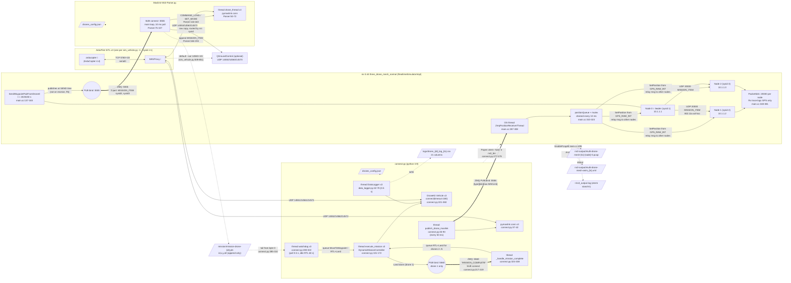

# UAVLnQ low-level design (as built)

Draft for Task 1.1.3. This describes the **3-drone leader-follower baseline** at commit `78f81d64`, as run on 2026-09-28 (run 1) and 2026-09-29 (run 2, correct start order; see [run2-evidence.md](run2-evidence.md)). Line references and finding IDs (F*n*) point to [uavlnq-code-review.md](uavlnq-code-review.md). The same diagram in editable form is in [uavlnq-lld.drawio](uavlnq-lld.drawio).

## 1. Component / interface flowchart

Legend:

| Line | Meaning |
|---|---|
| Solid arrow | UDP MAVLink |
| Thick arrow | ZeroMQ over TCP on localhost |
| Dotted arrow | File or process relationship |

`(i)` means drone index 0..2, and sysid = i+1.



### Process and thread inventory

| Process | Threads | Binds / listens | Connects / sends to |
|---|---|---|---|
| arducopter ×3 | (SITL) | TCP 5760, 5770, 5780 | — |
| MAVProxy ×3 | (MAVProxy) | — | TCP 5760+10i; UDP out 1455x/1456x/1457x (x = 1, 2, 3) plus 14550+10i and 14551+10i |
| `connect.py` | main; 3× connect (short-lived); `publish_drone_mavlink`; `_handle_mission_complete`; 3× watchdog; 3× `execute_mission`; 3× DataLogger; plus DroneKit internals | UDP 14551/61/71, 14552/62/72 (udpin); ZMQ PUB 5556; ZMQ PUB 5560 | ZMQ SUB 5560; child process ns-3 |
| ns-3 `three_drone_mesh_normal` | simulator (realtime); `ZmqPositionReceiverThread` | ZMQ PUB 5555 | ZMQ SUB 5556 |
| `Mavlink-NS3-Parser.py` | main; 3× `drone_thread` | UDP 14553/63/73 (udpin) | ZMQ SUB 5555; UDP to 14550/60/70 |

## 2. Start order

The components must start in this order: **SITL ×3 → `Mavlink-NS3-Parser.py` → `connect.py`**. `connect.py` then launches ns-3.

The ZeroMQ 5555 link is PUB/SUB with no handshake. ns-3 publishes the leader's waypoints at t = 20/30/40 s, and a subscriber that joins after that never receives them (F8).

| Run | Order | Result |
|---|---|---|
| 1 | Parser started last | Received nothing |
| 2 | Parser started first, connected 50 s before ns-3 bound 5555 | Received all 6 waypoints |

The full procedure is in [uavlnq-code-review.md, "Correct run procedure"](uavlnq-code-review.md#correct-run-procedure-verified-in-run-2).

## 3. Sequence of one run

This is the intended flow. Notes mark what run 1 (2026-09-28) and run 2 (2026-09-29) actually did.

```mermaid
sequenceDiagram
  autonumber
  participant SITL as SITL+MAVProxy x3
  participant CP as connect.py (main)
  participant TH as connect.py threads<br/>(mission / watchdog / pub)
  participant NS as ns-3 (3 nodes)
  participant PA as Mavlink-NS3-Parser.py
  participant F as mission/*.pln

  Note over SITL: sim_vehicle.py -I0..2 --sysid 1..3<br/>--out 1455x/1456x/1457x<br/>wait for EKF3 IMU0 is using GPS
  Note over PA,CP: Start order: parser BEFORE connect.py (F8)
  PA->>PA: SUB connect :5555, wait_heartbeat 14553/63/73
  CP->>CP: PUB bind :5556 (import time)
  CP->>SITL: pymavlink wait_heartbeat 14552/62/72
  CP->>SITL: DroneKit connect 14551/61/71 (timeout 180 s, until armable)
  CP->>NS: Popen xterm -hold -e ns3_bin --o=... --simTime=200
  NS->>NS: PUB bind :5555, SUB connect :5556, schedule t=20/30/40
  CP->>TH: start publish_drone_mavlink
  loop every 50 ms
    TH->>NS: ZMQ 5556 [type][idx][GPS_RAW_INT | SYS_STATUS | HEARTBEAT]
    NS->>NS: SetPosition(node idx), relay to other nodes on UDP 20000
  end
  CP->>TH: per drone: start watchdog (reads .pln from byte 0), start mission thread
  TH->>SITL: GUIDED, arm, simple_takeoff(10 m) (wait at most 30 s)
  TH->>TH: DataLogger start -> logs/drone_N_log_ts.csv
  Note over TH,F: Run 1: watchdog replayed committed waypoints in<br/>mission-drone-1/-2.pln (F7). Run 2: follower files<br/>emptied first; drone 1 again flew its committed file

  rect rgb(235,245,255)
  Note over NS: t = 20 s, 30 s, 40 s: SendWaypointPairFromDrone0
  NS->>NS: node0 -> node1, node2: UDP 20000 MISSION_ITEM (x,y,z)
  NS->>PA: ZMQ 5555 same two packets, published at send time (F6)
  Note over NS: Run 1 pcaps: t=30 s both and t=40 s one unicast<br/>failed after 7 tries, still published to ZMQ.<br/>Run 2: all 6 ACKed on first try
  PA->>F: append "target,x,y,z" to mission-drone-{target}.pln
  Note over PA,F: Run 1: nothing appended (parser joined late, F8).<br/>Run 2: 6 lines appended (3 per follower), last at t=40 s
  end

  loop every 0.5 s
    TH->>F: size grew? read new lines
    TH->>TH: queue MoveToWaypoint(east=x, north=y, up=z)
  end
  TH->>SITL: SET_POSITION_TARGET_LOCAL_NED every ~0.1 s until < 0.5 m
  Note over SITL: Run 2: drones 2 and 3 flew all 3 leader waypoints at 30 m,<br/>holding at N10 E60 and N30 E20

  alt no command popped for 60 s (per drone)
    TH->>TH: queue ReturnHome + Land
    TH->>SITL: mode RTL, then LAND
  end
  TH->>TH: drone 1 Land done: PUB 5560 "MISSION_COMPLETE"
  TH->>TH: _handle_mission_complete queues RTL+Land for drones 2..N
  TH->>SITL: RTL / LAND followers
  Note over SITL: Run 1: all disarmed by 20:00:04.<br/>Run 2: all disarmed by 18:31:23
  NS->>NS: t = 200 s: Simulator::Stop, pcaps + NetAnim XML closed
  Note over CP: connect.py keeps running until Ctrl+C (F13),<br/>then cleanup(): stop, terminate ns-3, LAND, close ZMQ.<br/>Run 2: with pipe to tee, cleanup aborted on BrokenPipeError (F29)
```
